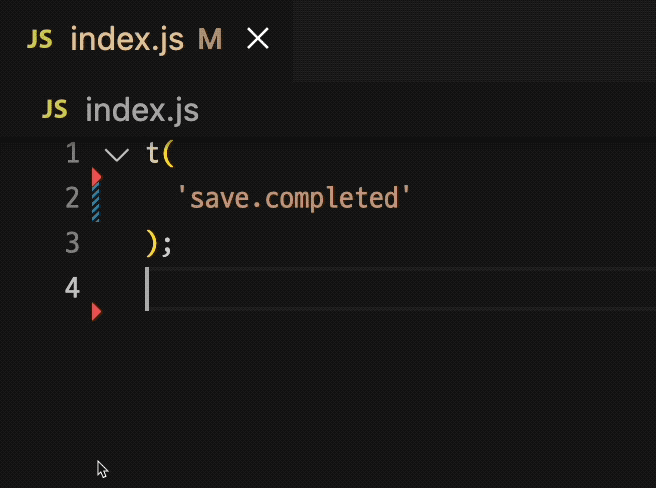
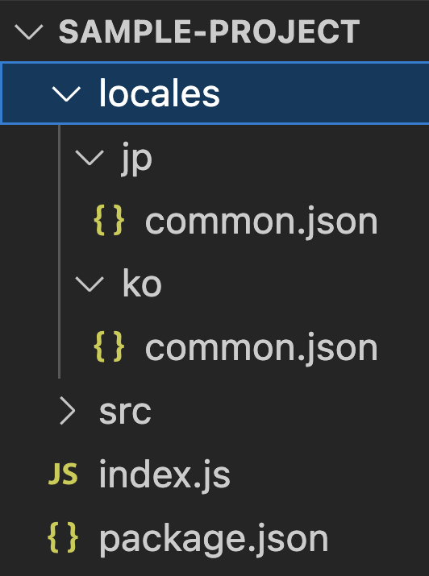
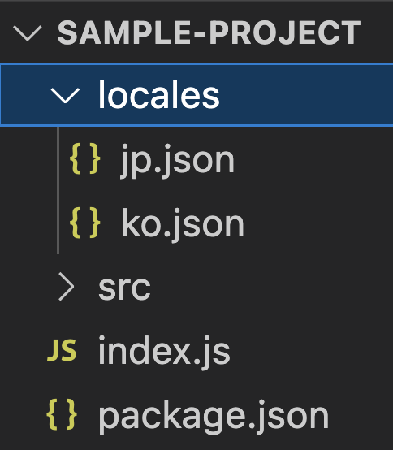
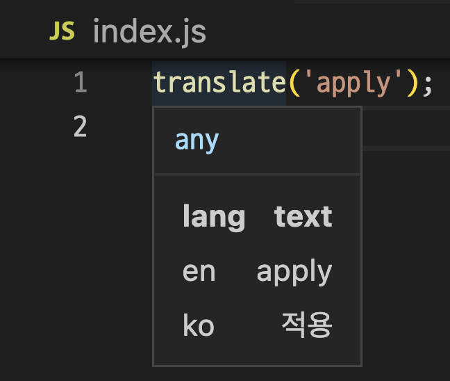
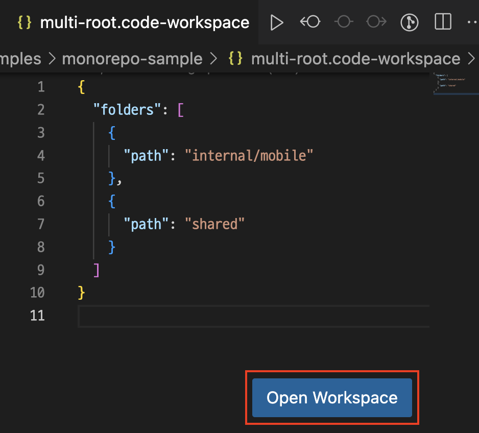
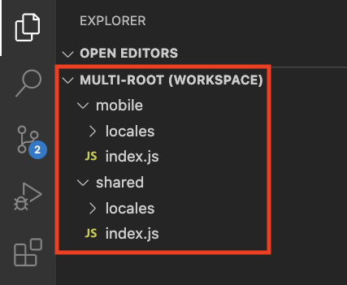
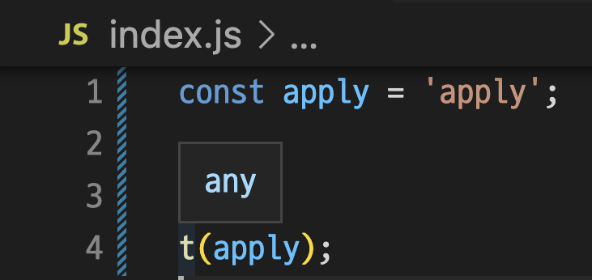
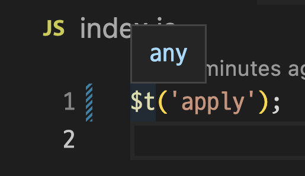
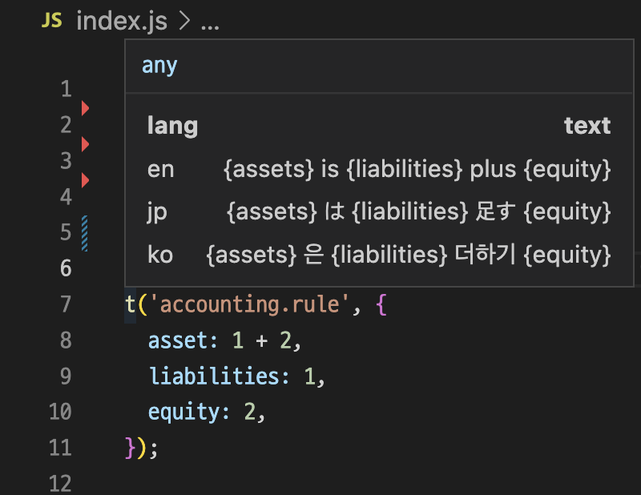

# i18n-Lens

<p align="center">

</p>

I18n-Lens is a VS Code extension which helps you develop with i18n library.  
You can see the translation data if you hover your mouse on i18n code.



# Index

- [Settings Options](#settings-options)
- [Getting Started](#getting-started)
- [Handling Monorepo Structure](#handling-monorepo-structure)
- [Features Not Supported](#features-not-supported)
- [License](#license)

## Settings Options

This extension contributes the following variables to the settings:

- `i18n-Lens.translatorFunctionName`: The name of translator function you use. Default value it `t`
- `i18n-Lens.localeDirectoryPath`: The path where translation files are located. Default value is `/**/locales`

## Getting Started

Setup options of i18n-Lens.

`cmd + shift + p` -> `Open User Settings`

**settings.json**

```json
{
  ...
  "i18n-Lens.translatorFunctionName": "translate",
  "i18n-Lens.localeDirectoryPath": "/**/locales"
}
```

(Since there are default settings attributes, you do not have to set them all if you don't need it.)

Then, locate the translation files into `/**/locales` directory

You can use both pattern below

> Pattern 1



> Pattern 2



Now you can see that the i18n-Lens are working.



## Handling Monorepo Structure

When multiple projects are managed by mono repo, the locale files may differ for each project.
In this case, you can use multi-root workspaces option to handle different locale files at once.

### What is multi-root workspaces?

Multi-root workspaces are feature that helps you managing multiple projects in a single VSCode editor.
You can see details in [here](https://code.visualstudio.com/docs/editor/multi-root-workspaces)

> You can work with multiple project folders in Visual Studio Code with multi-root workspaces. This can be helpful when you are working on several related projects at one time.

If you want to use i18n-Lens in multi-root workspaces, you do not have to set anything for it. i18n-Lens identifies if the editor is running as a multi-root workspaces. The i18n-Lens then automatically manages i18n by each workspace respectively.

### How to setup multi-root workspaces

Create file <name>.code-workspace within the monorepo root directory.  
(\* It is not necessary to have `.code-workspace` file inside the project directory. It works fine even if you create the file outside of the project.)

There are no rule for name of `.code-workspace` file. However, It is common to use the monorepo root name.

```bash
cd **/monorepo-sample
touch monorepo-sample.code-workspace
```

```bash
monorepo-sample
├── internal/
│   ├── mobile/
│   └── pc/
├── shared/
└── monorepo-sample.code-workspace <=
```

Edit the `.code-workspace` file as below.

```json
{
  "folders": []
}
```

Select the projects you want to work on and type the relative path of the projects inside `folders` array. In this document, `internal/mobile` and `shared` will be included.

```json
{
  "folders": [
    {
      "path": "internal/mobile"
    },
    {
      "path": "shared"
    }
  ]
}
```

Now, you can see that **`Open Workspace`** button is activated in the lower right corner.



Clicking the button will activate multi-root workspaces.



### Disadvantages of using multi-root workspaces

- Projects to work on multi-root workspaces must be **manually entered** one by one.
- You **can not access the file inside the monorepo** root directory. (Because only registered project folders are accessible in the sidebar.)
- You need to register **all** the projects that you need to work on even if some of them does not need i18n.

### Using one common locales within multiple projects

In this case you should not use multi-root workspaces.

You can just open monorepo-root directory as an workspace.

## Features Not Supported

> You cannot use variable as a key of i18n function.



<br/>

> If you put special characters in a translator function name, it won't work.



<br/>

> The extension can not recognize the second parameter of i18n function.



## License

```
Copyright 2022-present NAVER Corp.

Licensed under the Apache License, Version 2.0 (the "License");
you may not use this file except in compliance with the License.
You may obtain a copy of the License at

   http://www.apache.org/licenses/LICENSE-2.0

Unless required by applicable law or agreed to in writing, software
distributed under the License is distributed on an "AS IS" BASIS,
WITHOUT WARRANTIES OR CONDITIONS OF ANY KIND, either express or implied.
See the License for the specific language governing permissions and
limitations under the License.
```
